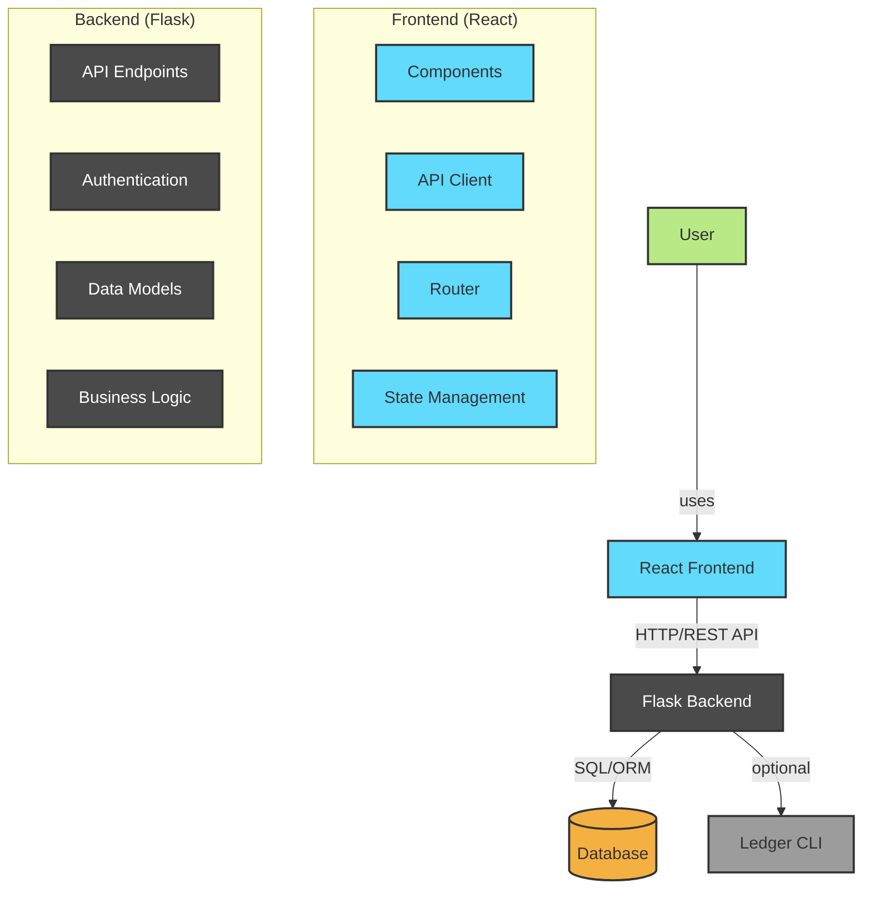
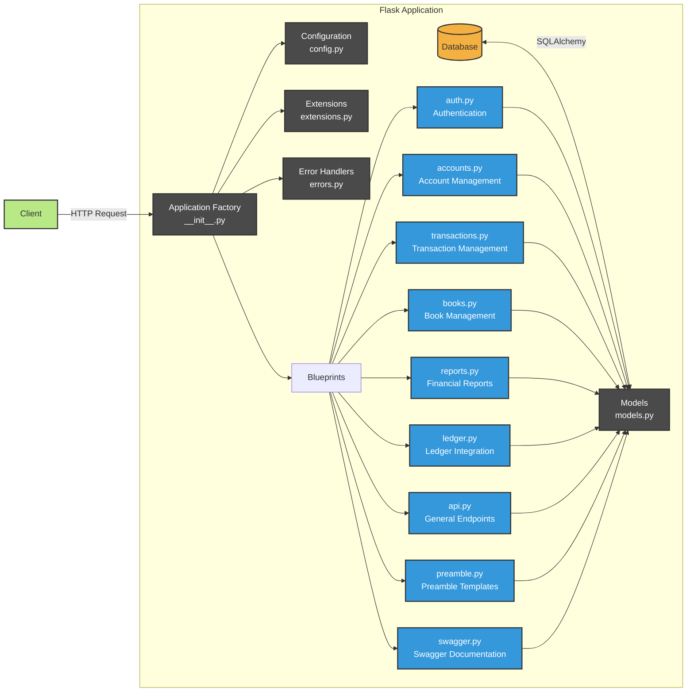
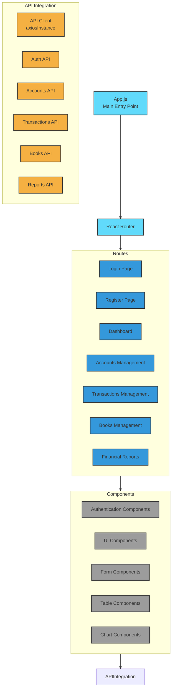
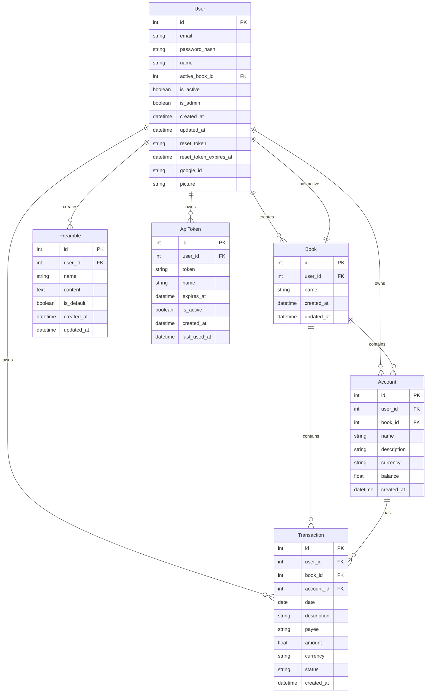
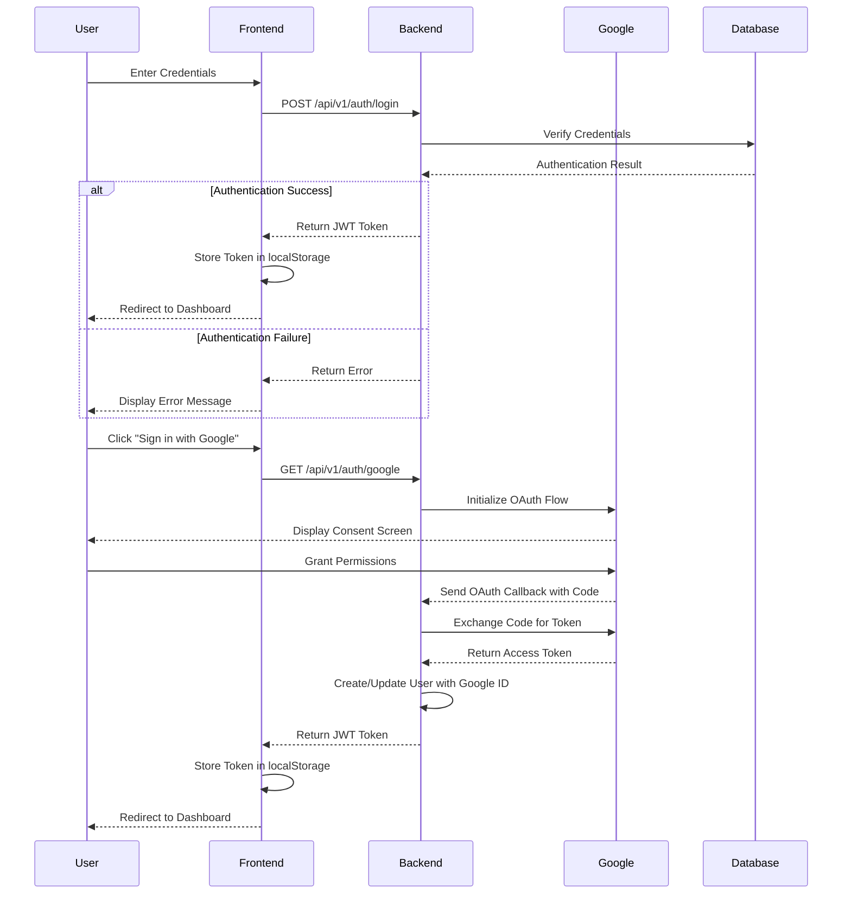
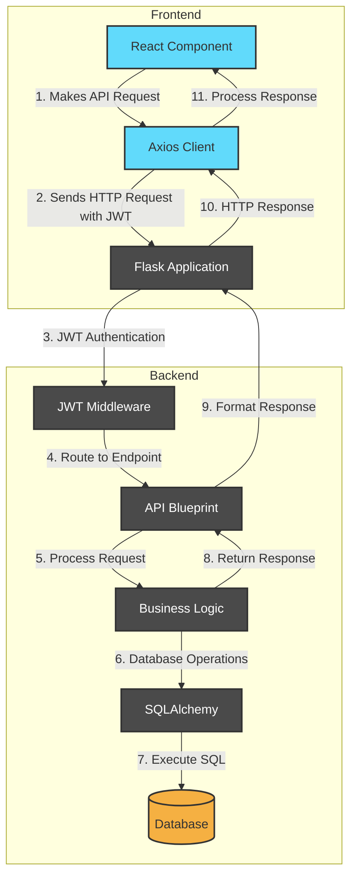
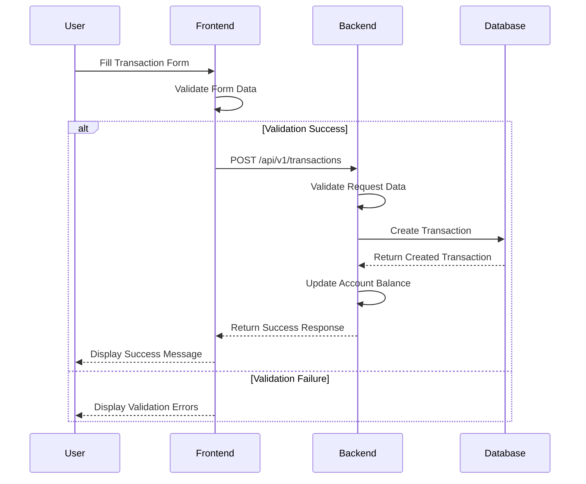
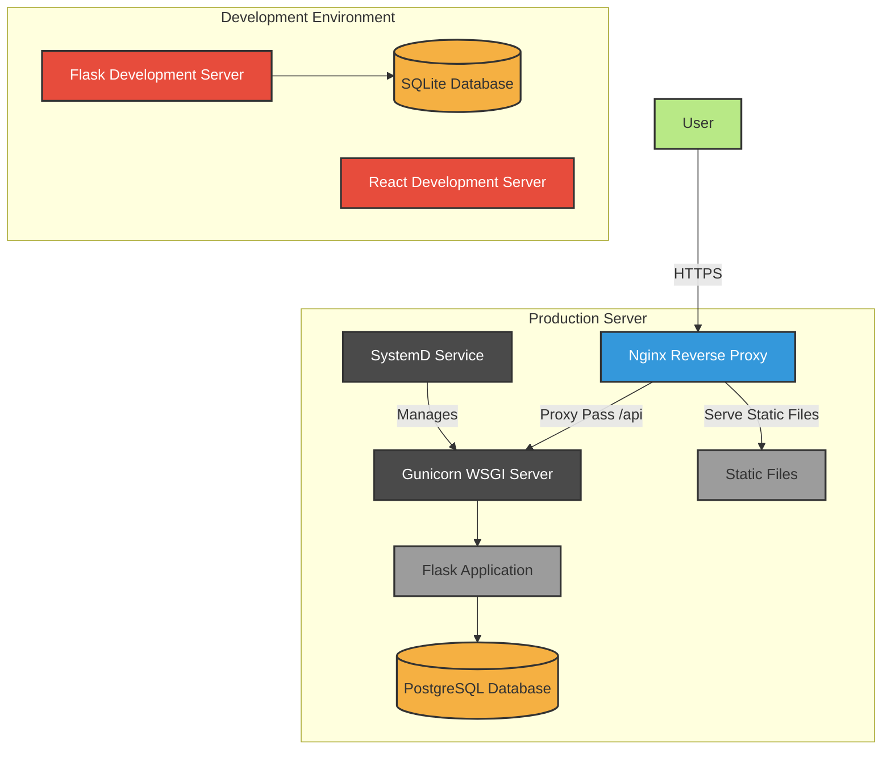
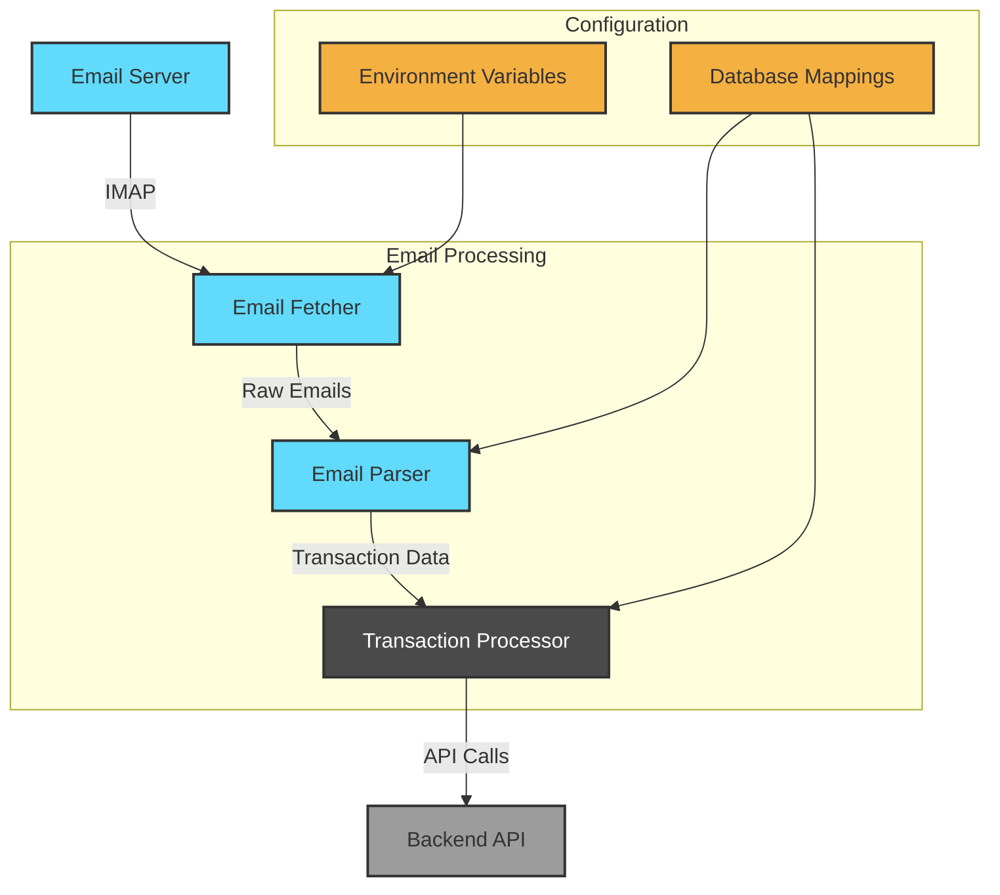

# Kanakku - Architecture Documentation

## Overview

Kanakku is a full-stack expense tracking application built with a Flask backend and React frontend. The application provides users with a way to manage financial transactions using double-entry bookkeeping principles inspired by the Ledger CLI tool.

## System Architecture

### High-Level Architecture



### Backend Architecture (Flask)

The backend follows a modular architecture using Flask Blueprints to organize the code by functionality:



1. **Application Factory Pattern** (`backend/app/__init__.py`):
   - Creates and configures the Flask application
   - Registers all blueprints and extensions
   - Sets up error handlers and middleware

2. **Models** (`backend/app/models.py`):
   - SQLAlchemy models representing the database schema
   - Key models include User, Book, Account, Transaction, Preamble, and ApiToken

3. **API Blueprints**:
   - `auth.py`: Authentication routes (login, register, JWT tokens)
   - `accounts.py`: Account management (CRUD operations)
   - `transactions.py`: Transaction management (CRUD operations)
   - `books.py`: Book entries for advanced accounting
   - `ledger.py`: Ledger CLI integration
   - `reports.py`: Financial reporting functionality
   - `api.py`: General API endpoints (health check, etc.)
   - `preamble.py`: Preamble template management
   - `swagger.py`: Swagger API documentation

4. **Configuration** (`backend/app/config.py`):
   - Environment-based configuration
   - Secret keys, database URLs, and other settings

5. **Extensions** (`backend/app/extensions.py`):
   - Flask extensions configuration (SQLAlchemy, JWT, CORS, etc.)

6. **Error Handling** (`backend/app/errors.py`):
   - Custom exception classes
   - Error handlers for different HTTP status codes

### Frontend Architecture (React)

The frontend is built with React and follows a component-based architecture:



1. **Application Entry** (`frontend/src/App.js`):
   - Main application component
   - Routing using React Router
   - Authentication state management

2. **Components**:
   - Organized by functionality in `frontend/src/components/`
   - Key components include:
     - Authentication components (login, register)
     - Transaction management (add, view, edit)
     - Account management
     - Book management
     - Dashboard for overview

3. **API Integration** (`frontend/src/api/`):
   - Axios-based API client with interceptors for authentication and CSRF
   - API endpoint wrappers for different resources

4. **UI Framework**:
   - Material-UI (MUI) for component styling and layout

## Database Schema



## Authentication Flow



1. **Traditional Authentication**:
   - User registers with email and password
   - User logs in to receive JWT token
   - JWT token is included in subsequent API requests

2. **Google OAuth Integration**:
   - User initiates Google login
   - Backend handles OAuth flow with Google
   - User account is created/linked with Google ID
   - JWT token is issued for authenticated session

## API Request Flow



## Transaction Flow



## Deployment Architecture



## Key Technologies

### Backend

- Flask: Web framework
- SQLAlchemy: ORM for database operations
- Flask-JWT-Extended: JWT authentication
- Flask-CORS: Cross-origin resource sharing
- Swagger: API documentation

### Frontend

- React: UI library
- Material-UI: Component library
- Axios: HTTP client with interceptors for authentication
- React Router: Client-side routing

### Development & Deployment

- Docker: Containerization
- Nginx: Reverse proxy for production
- Systemd: Service management for production deployment

## Security Considerations

1. **Authentication**:
   - JWT tokens with proper expiration
   - Password hashing with Werkzeug
   - Token-based password reset
   - Google OAuth integration

2. **Authorization**:
   - Role-based access control (admin vs. regular users)
   - Resource ownership validation
   - API token-based access for programmatic usage

3. **Input Validation**:
   - Comprehensive validation on both frontend and backend
   - SQLAlchemy ORM to prevent SQL injection

4. **API Security**:
   - CORS configuration
   - CSRF protection for non-GET requests
   - Rate limiting for authentication endpoints
   - Secure cookie handling
   - Bearer token authentication

5. **Error Handling**:
   - Custom error handlers with appropriate HTTP status codes
   - Sanitized error messages in production

## Future Architectural Improvements

1. **Caching Layer**:
   - Implement Redis for caching frequently accessed data
   - Cache expensive report calculations

2. **Microservices**:
   - Split monolithic backend into microservices
   - Separate authentication, transaction processing, and reporting

3. **Real-time Updates**:
   - Implement WebSockets for real-time transaction updates
   - Push notifications for important events

4. **Scalability**:
   - Move from SQLite to PostgreSQL for production
   - Implement horizontal scaling with load balancing

5. **API Documentation**:
   - Enhanced Swagger documentation
   - Interactive API explorer

## Bank Transaction Processing System

The bank transaction processing system is a separate module that automates the extraction and categorization of transactions from bank emails.

### System Architecture



### Components

1. **Email Fetcher** (`banktransactions/imap_client.py`):
   - Connects to email servers via IMAP
   - Fetches new transaction emails
   - Handles email deduplication
   - Manages email server connections

2. **Email Parser** (`banktransactions/email_parser.py`):
   - Extracts transaction details from email bodies
   - Handles different bank email formats
   - Parses transaction amounts, dates, and descriptions
   - Extracts masked account numbers

3. **Transaction Processor** (`banktransactions/main.py`):
   - Processes extracted transaction data
   - Maps transactions to expense categories
   - Maps bank accounts to ledger accounts
   - Submits transactions to the backend API

4. **Configuration** (Database-stored mappings):
   - Bank account mapping
   - Expense category mapping
   - Transaction descriptions
   - Environment variables for credentials

### Data Flow

1. **Email Fetching**:
   - System connects to email server using IMAP
   - Fetches new transaction emails
   - Checks for duplicates using processed IDs

2. **Transaction Extraction**:
   - Parses email body for transaction details
   - Extracts amount, date, description
   - Identifies bank account from masked number

3. **Transaction Processing**:
   - Maps bank account to ledger account
   - Categorizes transaction based on merchant
   - Generates transaction description
   - Creates transaction data structure

4. **API Integration**:
   - Submits transaction to backend API
   - Handles API errors and retries
   - Updates processed email IDs

### Configuration

The system uses two types of configuration:

1. **Environment Variables**:

   ```bash
   GMAIL_USERNAME=your-email@gmail.com
   GMAIL_APP_PASSWORD=your-app-password
   BANK_EMAILS=alerts@axisbank.com,alerts@icicibank.com
   ```

2. **Database-stored Mappings** (accessed via API):
   - Bank account mappings: Map masked account numbers to ledger accounts
   - Expense account mappings: Map merchant names to expense categories and descriptions
   - Managed through the web interface or API endpoints

### Error Handling

The system includes robust error handling for:

- Email server connection issues
- Email parsing errors
- Transaction mapping failures
- API communication errors
- Configuration problems

### Integration with Main Application

The bank transaction processing system integrates with the main application through:

- REST API endpoints for transaction submission
- Database-stored configuration for account mapping
- Common transaction data model
- Unified error handling 