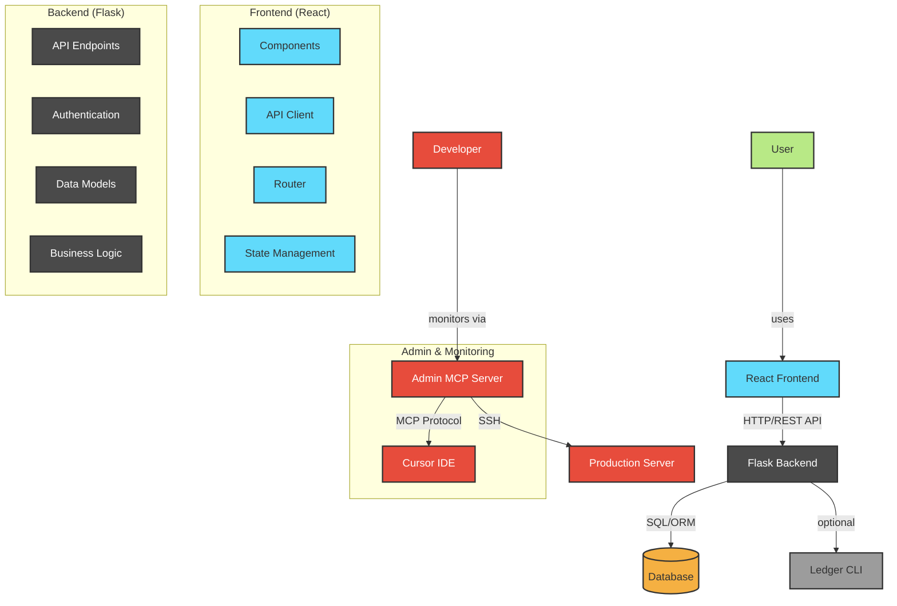
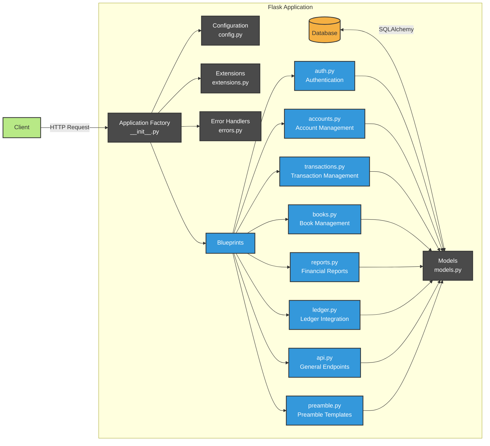
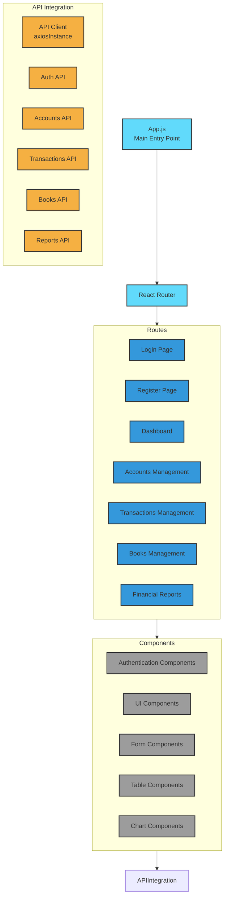
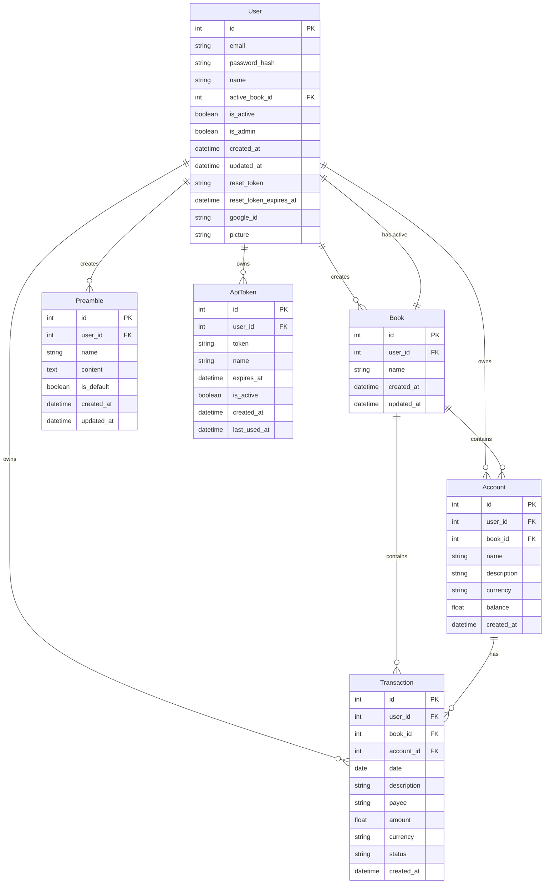
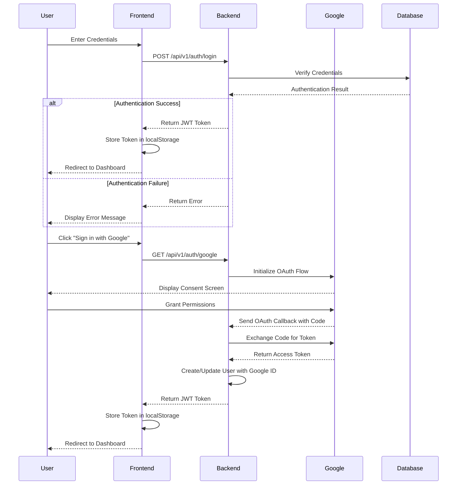
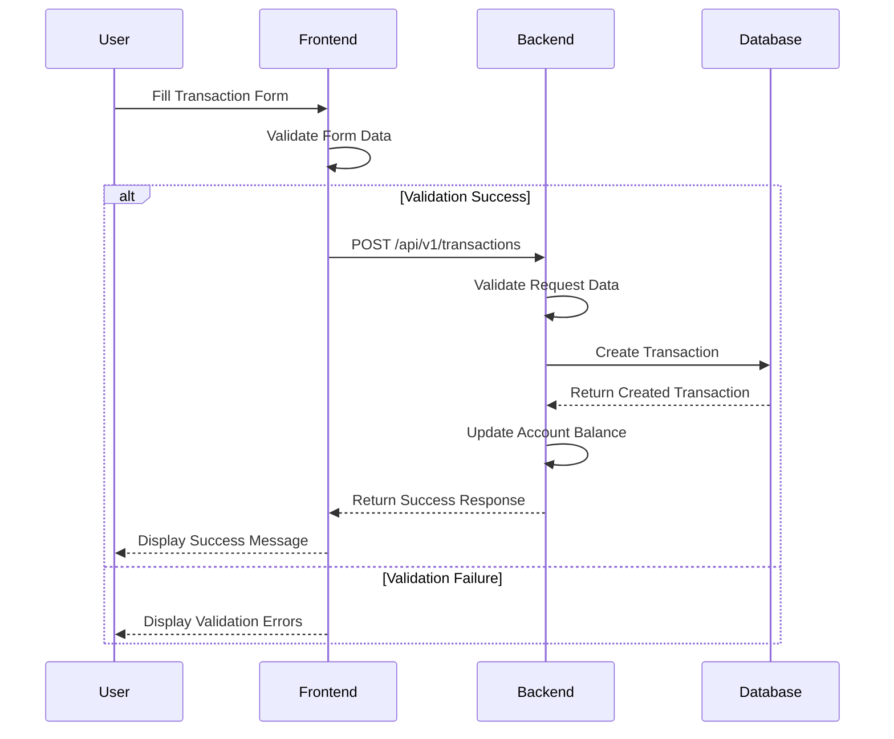
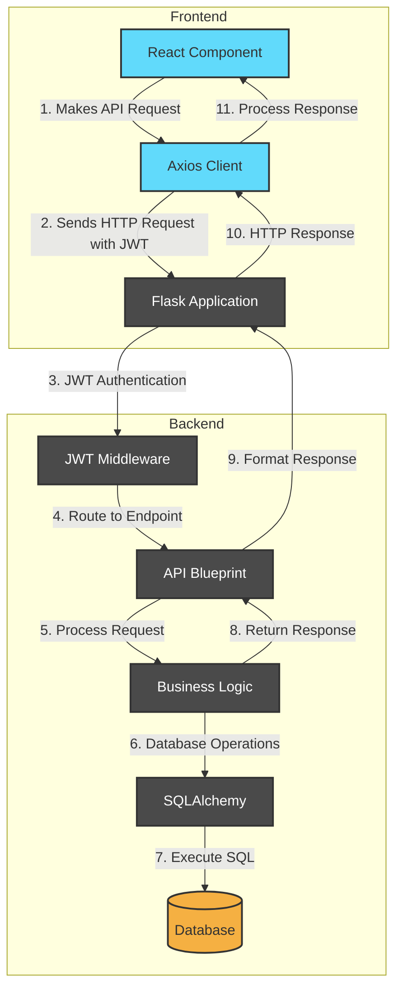
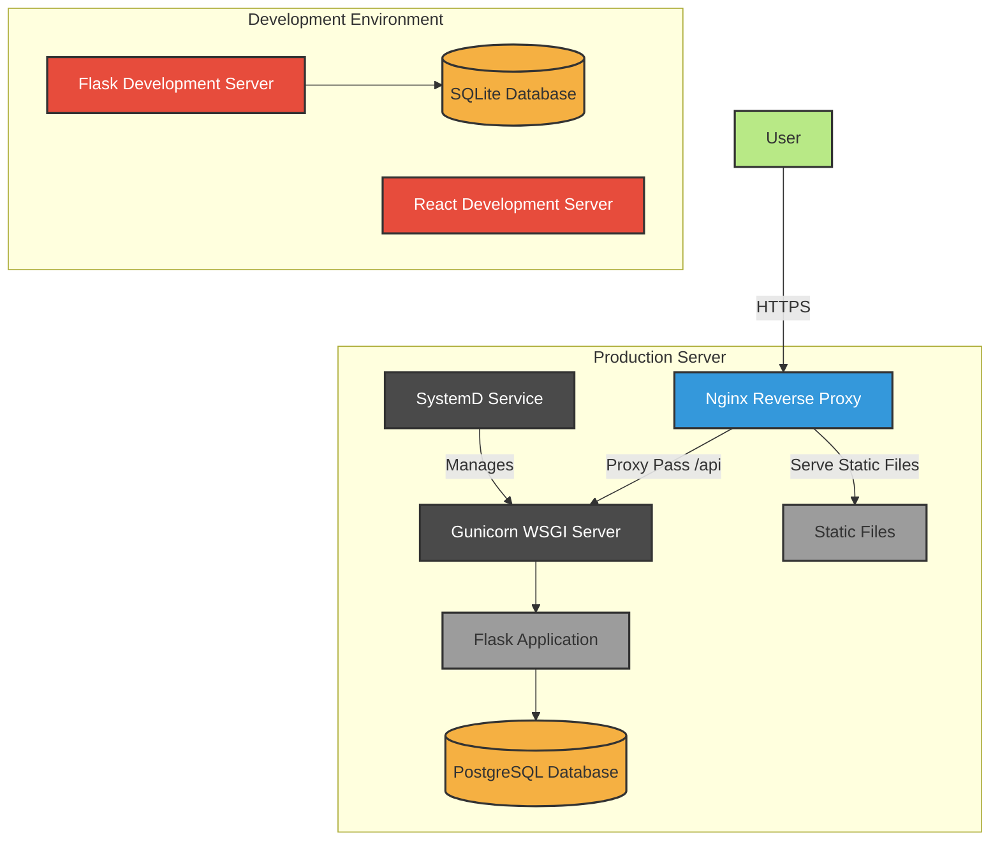
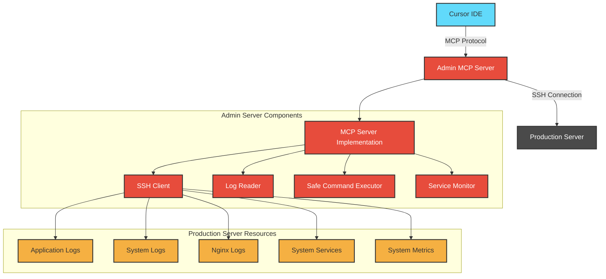
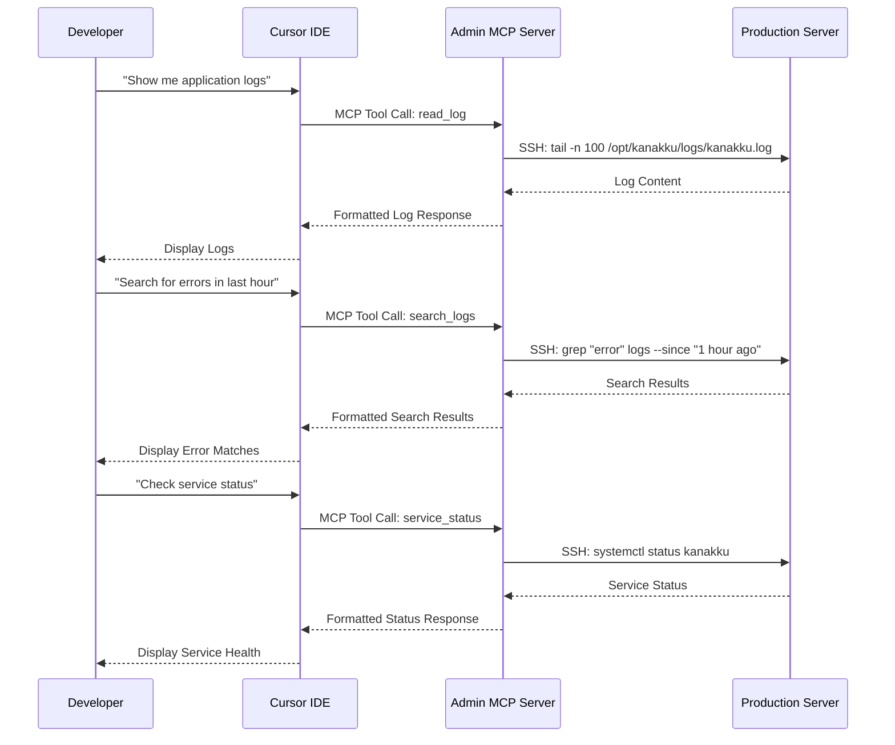

# Kanakku Architecture Diagrams

This document contains architectural diagrams for the Kanakku application using Mermaid notation.

## 1. High-Level System Architecture

## 2. Backend Component Architecture

## 3. Frontend Component Architecture

## 4. Database Entity Relationship Diagram (ERD)

## 5. Authentication Flow

## 6. Transaction Creation Flow

## 7. API Request Flow

## 8. Deployment Architecture

## 9. Admin Server (MCP Server) Architecture

## 10. Admin Server Usage Flow

